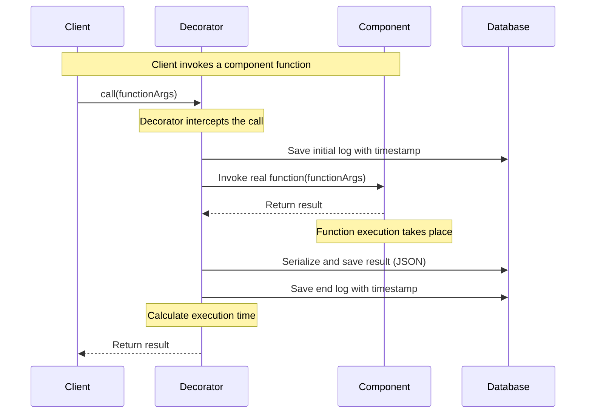
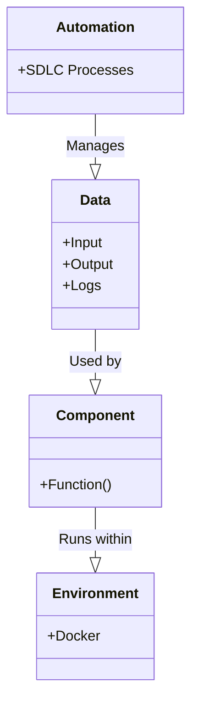

# www.moduletool.com

+ [docs.ModuleTool.com](https://docs.moduletool.com/)
  + [Hi level solution](https://docs.moduletool.com/1/)
  + [Low level solution](https://docs.moduletool.com/2/)

## Problem

Czy również spotykasz się ze ścianą w rozwoju biznesu w modelu SaaS?
+ "nie będę mógł sam rozwijać projektu, bo potrzebuję co najmniej testera manualnego, żeby stale monitorować zmiany a to wymaga budowania zespołów."

## Dzis

Dyskusja z klientem to narzędzie co prawda niezbyt wyrafinowane, ale w większości wypadków się sprawdza, jednak wyobraźmy sobie sytuację, gdzie klient zamawia oprogramowanie a wszelkie wskazówki są uwzględniane bezpośrednio przez usługę, która jest częścią autonomicznego systemu. Korekcja rozwiązania następuje przez wskazówki klientów i analizę działania przez sam framework, który generuje usługę.

#AutonomousOperationsFramework https://www.workato.com/accelerators/autonomous_operations_framework

## Rozwiązanie

Rozwiązaniem może być AutonomousOperationFramework, czyli w skrócie: decorator + logi jako obiekty w bazie danych z analizą wejść wyjść. 
Nie musisz zatrudniać ludzi, kwestia jak podchodzisz do SDLC. 
Programowanie powinno być procesem wytwórczym algorytmu ze sprzężeniem zwrotnym na bazie modułów lub generowane poprzez ML na bazie specyfikacji i dopracowywane poprzez logi/debugging.

Nasze rozwiązanie nie tylko przyśpiesza wytwarzanie oprogramowania, ale zwiększa jakość, modułowosć, reużycie w przyszłych projektach już przetestowanych modułach

## Testowanie

+ Jak testować backend i frontend w pełni automatycznie? ktoś musi je pisać/nagrywać...
+ Z tym generowaniem przez ML też bywa słabo

Framework ModuleTool to kod hipermodularny, HTML jest strukturą, którą można kontrolowac, bo JS również jest pisany pod te zdarzenia. 
Istotą jest generowanie frontendu i backendu z jednej dokumentacji, aby była konsystentna, aby oczekiwania były spójne i możliwe do walidacji. 
Kwestia wybrania odpowiednich zespołów modułów w modularnej sieci kodu, by same z siebie były już zwalidowane. 

## Idea 

ten projekt powstał z braku czasu ani zasobów na prototypowanie.
Trzeba też utrzymać wzrost bez dodatkowych kosztów z łatwą integracją.
DLatego najlepiej zamiast używać rozproszonej infrastruktury mieć skonsolidowane usługi na jednej maszynie która wykonuje wszystkie potrzebne procesy nawet na laptopie.

Dziś każdy z nas może tworzyć swój One Person SaaS.
Od zera, na bazie tylko integracji z kilkoma usługami porzez klucze API można połączyć framework z repozytorium git i API openAI, by otrzymywać samoaktualizujące się oprogrmoawnaie, które
doskonali się na bazie własnych błędów.

### GenAI

The GenAI surprised us last year!

+ How quickly we can accept these possibilities, so in fact they bring true value, not just interesting PoC and experiments?
+ What can help us today?
+ What tool are available?

### Service-based perspective 

We need more tools, you can call them:
+ Service-based component management tools
+ Network of Source-code management system 

Such component management tools are more important than the knowledge of hypermodularity.
Here is a tool which bring us the power of serving open and hypermodular architecture

## Autonomous Services Framework

ModuleTool is supporting creating and managing autonomous or automated services in a system architecture with a focus on modularity, scalability, and self-management. 

The concept of autonomous services is associated with microservices architectures where different services operate independently and possibly with autonomous decision-making abilities. In such architectures, services communicate with each other through well-defined interfaces, and each service is responsible for a specific piece of functionality within the larger application.

## Features of framework

1. **Service Discovery**: Mechanisms for services to dynamically discover and interact with each other in a constantly changing environment.
2. **Load Balancing**: Distributing requests among multiple service instances to optimize resource usage and response times.
3. **Fault Tolerance**: Providing robustness against failures, with patterns like retries, circuit breakers, and fallbacks.
4. **Scaling**: The ability to automatically adjust the number of service instances based on the demand.
5. **Monitoring and Logging**: Tools to track the performance and health of services, and to diagnose issues when they arise.
6. **Continuous Delivery/Deployment**: Support for deploying updates to services with minimal downtime, often through automated pipelines.

## Another tools

Examples of tools and platforms that offer similar functionality to what you might expect in an Autonomous Services Framework include:

- **Kubernetes**: An open-source platform designed to automate deploying, scaling, and operating application containers.
- **Docker Swarm**: A container orchestrator provided by Docker, Inc. that helps manage a cluster of Docker Engines.
- **Apache Mesos**: A cluster manager that provides efficient resource isolation and sharing across distributed applications or frameworks.
- **Netflix OSS**: A set of frameworks and tools for building microservices, which includes Eureka for service discovery, Hystrix for fault tolerance, and Ribbon for load balancing, among others.
- **Istio**: An open platform to connect, manage, and secure microservices, which provides an easy way to create a network of deployed services with load balancing, service-to-service authentication, and monitoring.

## diagram

mermaid diagram for the Autonomous Services Framework called module tool is using decorator on each component  to save logs to DB and observe how works the software, how long it take to start component. Each component is a defined by sentence generated function which has input arguments and returned objects, all of them are directly saved in DB as serialized objects or json objects to check the results later on and check if the function is working properly, 

Layers of software:
+ environment: docker
+ component: function
+ data: input, output, logs
+ automation: SDLC

And here's a rough interpretation of what each class represents:

- **Environment**: The Docker container environment where components are encapsulated, providing a consistent and isolated runtime across different systems.
- **Component**: This could represent a specific microservice or function within your Autonomous Services Framework, which performs a particular task or set of tasks.
- **Data**: This includes the inputs provided to components, the outputs they generate, and the logs tracking their behavior and performance.
- **Automation**: This represents automation workflows or tools implemented within the SDLC to streamline development, testing, deployment, and monitoring.

In the diagram, the connector lines represent the following relationships:

- Component "Runs within" Environment: The function/component is executed within the Docker environment.
- Data "Used by" Component: The function/component consumes input data, produces output data, and generates logs.
- Automation "Manages" Data: SDLC processes manage how data is handled, potentially through automated testing, deployme

  
during the service is running, components decorator is saving the logs to DB with variables

In this diagram:

- **Client**: This represents the entity (e.g., user, system, or another service) that calls the function.
- **Decorator**: This is a wrapper around the actual component that provides logging and observation functionality. It saves logs to the database with timestamps and serialized function results.
- **Component**: The main functional unit that performs the action defined by the framework. This would encapsulate the 'sentence generated function' you mentioned.
- **Database**: This is where logs, serialized objects, and JSON representations of the arguments and results are stored for later analysis.

The sequence of actions is as follows:

1. The client invokes a component function by sending it the necessary arguments.
2. The decorator intercepts this call and first logs the initial timestamp to the database indicating the start of the execution.
3. The decorator then invokes the actual function within the component, passing the function arguments.
4. The component executes its logic and returns the result to the decorator.
5. The decorator serializes this result (possibly as a JSON object) and saves it to the database along with a log of the end timestamp.
6. The decorator calculates the total execution time based on the timestamps.
7. Finally, the decorator returns the result of the function back to the client.

## Prototyping framework 

a prototyping framework for component-based software development plays a crucial role in enabling fast iteration, simulation, and testing. Here are some examples of prototyping frameworks and supporting tools that could be used for this purpose:

1. **Robot Operating System (ROS)**: ROS is an open-source robotic middleware that offers a collection of tools, libraries, and conventions for simplifying the task of creating complex and robust robot behavior across a wide variety of platforms. ROS components are organized into packages, and each package can contain nodes, libraries, and drivers, making it a powerful prototyping tool for autonomous systems.

2. **Gazebo**: Often used in conjunction with ROS, Gazebo is a robotics simulator that provides an excellent virtual environment to prototype, design, and test autonomous robots in various conditions without the inherent risk and cost associated with physical prototyping.

3. **Microsoft Robotic Developer Studio (MRDS)**: MRDS offers an integrated, end-to-end development environment for building and testing robot applications. It includes a set of tools that support rapid prototyping through the use of a realistic 3D simulation environment.

4. **Webots**: Webots is another open-source robot simulator that provides a complete development environment to model, program, and simulate robots. With a wide variety of virtual sensors and actuators, it's suitable for prototyping component-based autonomous systems.

5. **Unity + ML-Agents**: Unity, primarily known for game development, offers a rich 3D simulation environment that can be leveraged to prototype autonomous systems. ML-Agents, a Unity plugin, enables machine learning agents to be trained in realistic scenarios, making it suitable for AI-driven autonomous system components.

6. **CoppeliaSim (formerly V-REP)**: CoppeliaSim is a robot simulation software with an integrated development environment that supports various types of sensors and actuators, capable of simulating complex algorithms and robotic behavior for prototyping purposes.

7. **MATLAB and Simulink**: Widely used for control systems design and simulation, these tools offer a block-diagram environment for multi-domain simulation and Model-Based Design. They are powerful for prototyping and testing the control algorithms of autonomous systems.

8. **PX4 Autopilot Software**: PX4 provides an open-source flight control software for drones and other unmanned vehicles. It has a modular design with numerous prebuilt components, making it suitable for the rapid prototyping of autonomous aerial systems.

9. **Apollo: An open autonomous driving platform by Baidu**, Apollo provides a comprehensive, flexible, and secure platform that includes a full set of innovative features tailored for autonomous vehicles. The platform is modular and scalable, allowing for rapid iteration and prototyping of autonomous driving components.

10. **AutoWare**: AutoWare is an all-in-one open-source software for autonomous driving. It is based on ROS and designed to implement all the necessary components for urban autonomous driving. It allows for prototyping of various aspects of self-driving systems from perception to control.

### Service-based component management tools

The tool is about network of code (Service-based components), based on git versioned code will help to manage the level of **resuabuility**, which is depended by:
+ class
+ file
+ protocol
+ Hardware virutalization
+ Network Topology 
  
The **network of code** need the service-based component management tools which will provide the ability to view, install and register components according to a model-based approach. 
Moreover, in practice, reuse is not a binary concept: there is a need to control and administer levels of reuse. 

Creating a service-based component management tool that integrates with versioned code repositories, such as those managed by Git, and aids in measuring code reusability across various levels, such as class, file, protocol, hardware virtualization, and network topology, would require some sophisticated features. Here is an outline of a solution approach that might help in building such a tool:

1. **Version Control Integration**: The tool would need to integrate seamlessly with Git or other version control systems to track changes in code and components over time.

2. **Reusability Metrics and Analysis**: It should be able to analyze code to determine the reusability of various components. It could use metrics like the number of times a class or function is reused, the coupling between components, and other established software engineering metrics.

3. **Dependency Mapping**: The solution would employ dependency mapping and visualization to understand the relationship between different components and services. This could extend to understanding the implications on network topology as well.

4. **Code Scanning and Cataloging**: Automated scanning and cataloging of the repository to identify reusable code components. Each class, file, and protocol could be tagged with metadata to facilitate searching and filtering based on reusability factors.

5. **Hardware Virtualization and Network Topology Tools**: Integration with tools and platforms that manage hardware virtualization and network topology, like VMware, OpenStack, or Cisco’s network management tools, could provide insights into how reusability is affected by hardware or network changes.

6. **Documentation and Reporting**: The tool should generate documentation and reports that provide developers and teams with insights into the levels of reusability within their projects.

7. **Governance and Compliance**: Ensure that the management tool supports compliance with industry standards and best practices for code reusability and maintainability.

8. **User Interface (UI)**: A user-friendly UI that allows developers and managers to interact with the management tool effectively, providing quick access to various metrics and analyses, and a clear visualization of component relationships and network dependencies.

9. **APIs and Extensibility**: An API layer that allows for the tool’s integration with other systems and extensibility so that it can accommodate future requirements, such as new metrics for reusability or changing standards for service-based architecture.

10. **Collaboration and Workflow Support**: Features that facilitate communication and collaboration within development teams, with built-in workflows that support code review, component sharing, and reuse.

11. **Automation and CI/CD Integration**: To fit into modern DevOps practices, the tool should integrate with existing continuous integration and continuous deployment pipelines, automating the assessment of reusability as part of the CI/CD process.

By focusing on these key aspects, a service-based component management tool can provide a comprehensive overview and management of a codebase’s reusability at various abstraction levels, from individual classes to entire service components operating within a hardware and network infrastructure context.

### Git is about versioning code

The [Git](https://en.wikipedia.org/wiki/Git) versioning system works at the code level and extends the capabilities of the modular network of code.
The distributed **version control system** that tracks changes in any set of computer files, usually used for coordinating work among programmers who are collaboratively developing source code during software development. 
I'ts goals include speed, data integrity, and support for distributed, non-linear workflows (thousands of parallel branches running on different computers).

## Keywords

+ prototyping framework for component-based software development
+ Autonomous system framework
+ Autonomous operations framework
+ Autonomous solution development

---
+ [edit](https://github.com/ModuleTool/www/edit/main/README.md)
+ [git](https://github.com/ModuleTool/)
